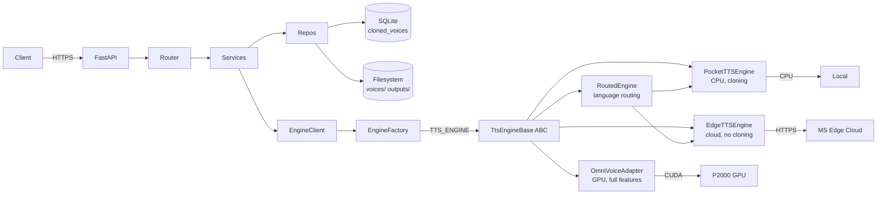
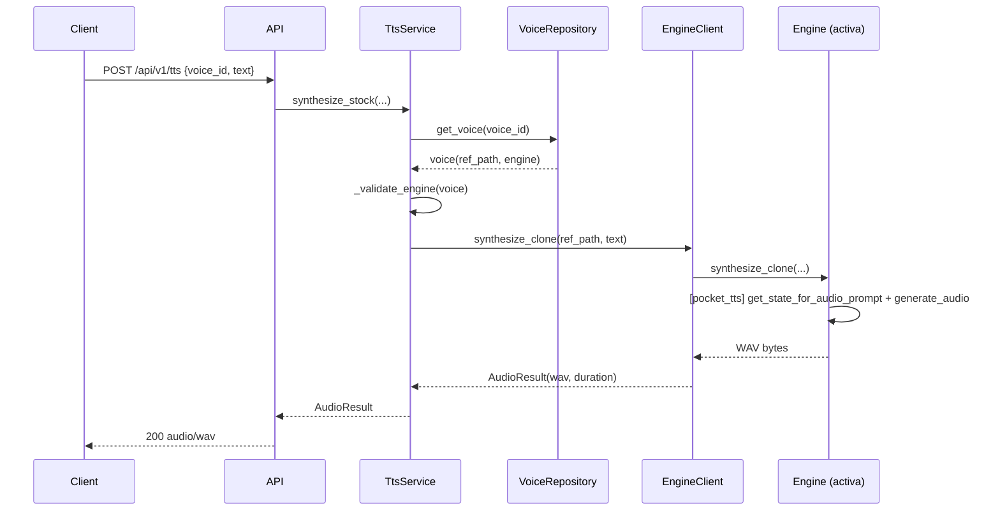

# Arquitectura — TTS API (Multi-Engine)

> **EN:** Multi-engine TTS REST API. Abstract engine interface with pluggable backends (Pocket TTS, EdgeTTS, OmniVoice) selected via `TTS_ENGINE` env var.

## 1. Visión general

Servicio HTTP que expone TTS multilingüe con **múltiples engines intercambiables**:
- **Pocket TTS** (`pocket_tts`) — CPU, clonado de voz, es/en/fr
- **EdgeTTS** (`edgetts`) — Cloud, 400+ voces incl. catalán, sin clonado
- **OmniVoice** (`omnivoice`) — GPU, emociones, voice design, instrucciones
- **Mock** (`mock`) — Tonos de prueba
- **Routed** (`routed`) — Enrutado por idioma a múltiples engines



## 2. Componentes

### 2.1 API Layer (`api/v1/`)
- Routers FastAPI, sin lógica de negocio
- Validación Pydantic de entrada/salida
- Serialización a JSON o streaming binario
- Manejo de `FeatureNotSupportedError` → HTTP 400

### 2.2 Services Layer (`services/`)
- **TtsService**: síntesis con voz stock/diseñada/clonada (lookup: cloned → designed → stock)
- **VoiceService**: alta/baja/listado de voces, validación de audio, validación de engine
- **ConversationService**: genera turnos de diálogo concatenando TTS
- **Transcription**: auto-transcripción de audio de referencia (opcional, faster-whisper)

### 2.3 Engine Abstraction (`core/`)

| Archivo | Responsabilidad |
|---------|-----------------|
| `engine_base.py` | `TtsEngineBase` ABC + `EngineCapabilities` (feature flags) |
| `engine_factory.py` | `create_engine()` — lee `TTS_ENGINE`, instancia el engine correcto |
| `engine_client.py` | Cliente con logging, validación WAV, timing |
| `engine_pool.py` | Semáforo de concurrencia |
| `engines/pocket_tts_engine.py` | Pocket TTS (CPU, 24000Hz, clonado) |
| `engines/edgetts_engine.py` | EdgeTTS (cloud, 24000Hz, 400+ voces) |
| `engines/omnivoice_engine_adapter.py` | Adapter de OmniVoice legacy (22050Hz, resample on clone) |
| `engines/mock_engine.py` | Tonos senoidales para testing |
| `engines/routed_engine.py` | Enrutado por idioma a múltiples sub-engines |

### 2.4 Capabilities System

Cada engine declara sus capacidades:

```python
@dataclass
class EngineCapabilities:
    stock_voices: bool
    voice_cloning: bool
    instruct_voice_design: bool
    emotions: bool
    streaming: bool
    supported_languages: list[str]
```

| Capability | Pocket TTS | EdgeTTS | OmniVoice | Mock |
|------------|:----------:|:-------:|:---------:|:----:|
| stock_voices | ✅ | ✅ | ✅ | ✅ |
| voice_cloning | ✅ | ❌ | ✅ | ❌ |
| instruct_voice_design | ❌ | ❌ | ✅ | ✅ |
| emotions | ❌ | ❌ | ✅ | ❌ |

### 2.5 Repositories (`repositories/`)
- **VoiceRepository**: CRUD sobre `cloned_voices` + `designed_voices` (SQLite)
- Campo `engine` almacena lista separada por comas: `"pocket_tts,omnivoice"`

### 2.6 Storage
- `storage/voices/<uuid>/reference.wav` — voces clonadas (24000Hz para pocket_tts)
- `storage/outputs/<job_uuid>.wav` — outputs temporales (TTL 1h)
- `storage/cache/` — caché de embeddings

### 2.7 Settings (`settings.py`)

**Engine selection:**
| Variable | Descripción | Default |
|----------|-------------|---------|
| `TTS_ENGINE` | Engine activo | `omnivoice` |
| `TTS_ENGINES` | JSON routing (cuando `TTS_ENGINE=routed`) | `""` |
| `POCKET_TTS_MODEL` | Modelo Pocket TTS | `kyutai/pocket-tts-100m-en` |
| `EDGETTS_VOICE_PREFIX` | Locale EdgeTTS | `es-MX` |
| `AUTO_TRANSCRIBE` | Auto-transcripción | `false` |

**Legacy (solo omnivoice):**
- `OMNIVOICE_MODEL_PATH`, `OMNIVOICE_DEVICE=cuda:0`, `OMNIVOICE_LANGUAGES`

**Comunes:**
- `MAX_REFERENCE_DURATION_SEC=30`, `OUTPUT_TTL_SECONDS=3600`

## 3. Modelo de datos

```sql
CREATE TABLE cloned_voices (
  id             TEXT PRIMARY KEY,        -- UUIDv4
  name           TEXT NOT NULL UNIQUE,
  language       TEXT NOT NULL,           -- ISO 639-1
  reference_path TEXT NOT NULL,
  duration_sec   REAL NOT NULL,
  created_at     TEXT NOT NULL,
  engine         TEXT NOT NULL DEFAULT 'omnivoice',  -- "pocket_tts,omnivoice"
  metadata       TEXT                     -- JSON (ref_text, original_path)
);

CREATE TABLE designed_voices (
  id         TEXT PRIMARY KEY,
  name       TEXT NOT NULL UNIQUE,
  instruct   TEXT NOT NULL,
  language   TEXT NOT NULL,
  created_at TEXT NOT NULL,
  metadata   TEXT
);
```

## 4. Flujo de una petición TTS (con voz clonada)



## 5. Concurrencia y rendimiento

- **EnginePool**: `asyncio.Semaphore(2)` — 2 síntesis simultáneas
- **Pocket TTS**: CPU, ~6x real-time en hardware moderno
- **EdgeTTS**: cloud, latencia de red
- **OmniVoice**: GPU, 1 síntesis (P2000 5GB VRAM)
- Motor llamado con `asyncio.to_thread` (no bloquea el event loop)
- Warmup al arranque (verificación de que el engine responde)

## 6. Errores y resiliencia

| Excepción | HTTP | Cuándo |
|-----------|------|--------|
| `VoiceNotFoundError` | 404 | Voz stock/clonada no existe |
| `UnsupportedLanguageError` | 400 | Idioma no soportado |
| `UnsupportedInstructError` | 400 | Token de instruct inválido |
| `FeatureNotSupportedError` | 400 | Feature no disponible en engine activo |
| `EngineUnavailableError` | 503 | Motor caído / no cargado |
| `InvalidReferenceAudioError` | 422 | Audio de referencia inválido |

## 7. Seguridad

- CORS configurable (`CORS_ORIGINS`)
- API key opcional (`X-API-Key`)
- Validación de tamaño de upload (max 10 MB)
- Sanitización de nombres de voz (regex `^[a-zA-Z0-9_-]{3,64}$`)

## 8. Observabilidad

- structlog con contexto por request (request_id)
- Métricas Prometheus en `/metrics`
- Logs en JSON a stdout

## 9. Despliegue

```bash
# Instalar con engine específico
make install ENGINE=pocket_tts

# Configurar routing multi-engine
echo 'TTS_ENGINE=routed' >> .env
echo 'TTS_ENGINES={"es":"pocket_tts","ca":"edgetts"}' >> .env

# Iniciar
make run
```

---

**EN:** Engine selected via `TTS_ENGINE` env var. Language routing via `TTS_ENGINES` JSON. Voice cloning supported on Pocket TTS and OmniVoice; EdgeTTS provides cloud quality without cloning.
